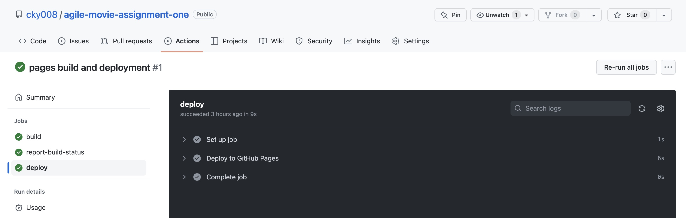
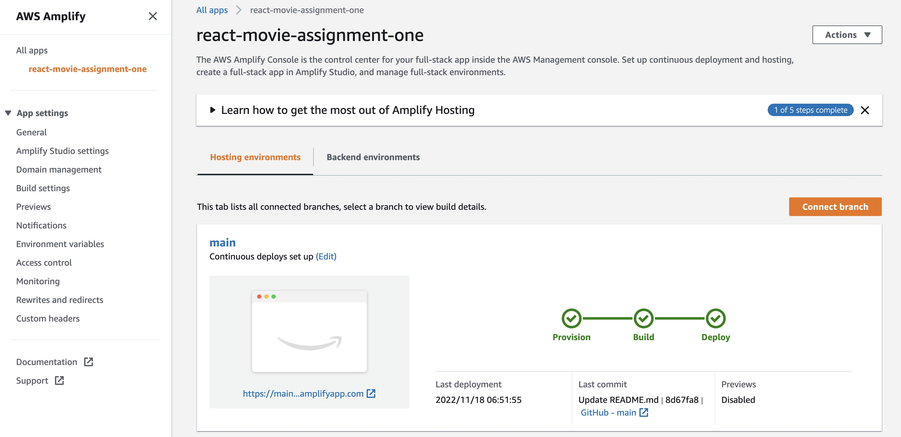
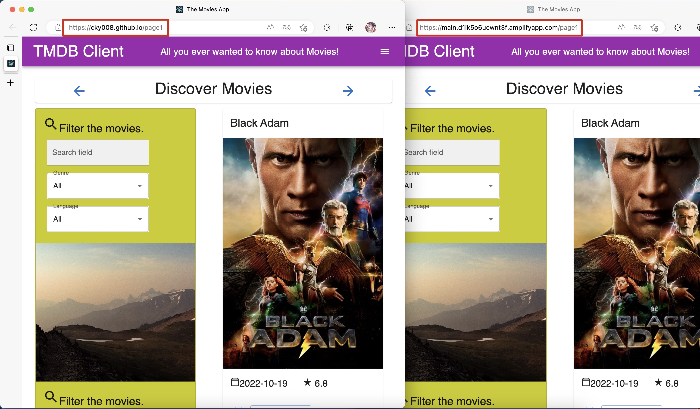
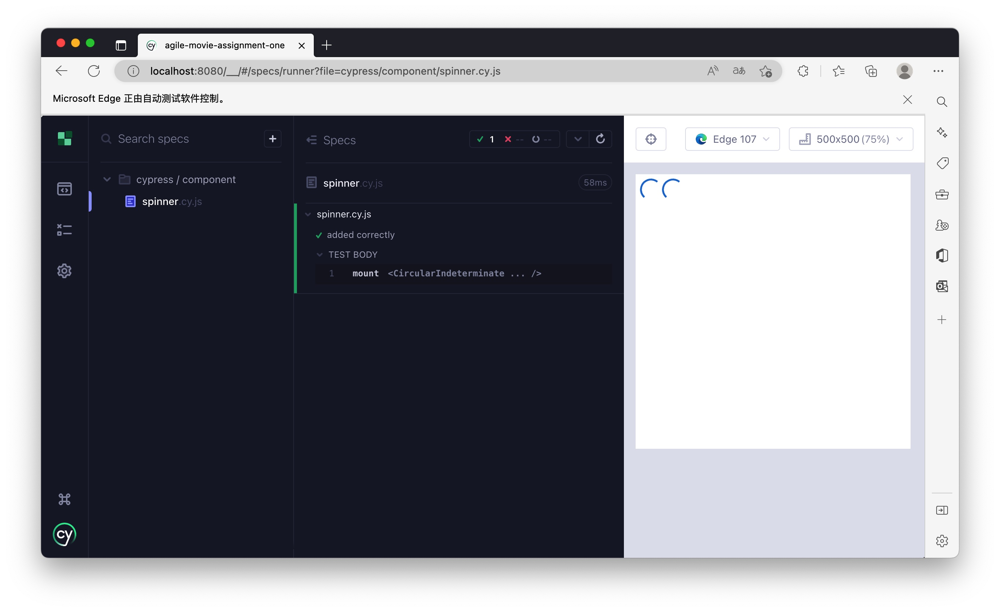

# Assignment 1 - Agile Software Practice.

__Name:__ Kaiyu Chen

This repository contains the implementation of a React App and its associated Cypress tests and GitLab CI pipeline.

## React App Features.

+ Change the style of the site header:  
  (Home Favourites Upcoming Option4)  
  to  
  (Home Movies[Favourites Upcoming] People)  
  [] is a drop-down menu.  
+ Add the Top Rated Movies Page.
+ Add the People page.  
+ Add the Person Details Page.  
+ Add Top Billed Cast Card on Movie Detail Page.  
+ Some new [endpoints](#api-endpoints).
+ Full Caching support.  
+ Full pagination support.  
+ Several extensive data hyperlinkings for individual persons(Acting Movies) and for individual movies(Top Billed Cast).  
+ Several parameterized URLs for individual person page(like individual movie page) and for every list pages(home, upcoming and people/person).  
+ New language filter.  
+ Add Firebase Authentication for Log in/Sign Up/Reset and each header.  
+ Auto-Deploy to [GitHub](https://cky008.github.io/agile-movie-assignment-one/).  
+ Auto-Deploy to [AWS Amplify](https://main.d1ik5o6ucwnt3f.amplifyapp.com/page1).  
+ Full Code Splitting Support.  

## Automated Tests.

### Best test cases.

+ [cypress/e2e/favourites.cy.js](cypress/e2e/favourites.cy.js)
+ [cypress/e2e/personDetails.cy.js](cypress/e2e/personDetails.cy.js)

### Cypress Custom commands (if relevant).

+ [cypress/e2e/favourites.cy.js](cypress/e2e/favourites.cy.js)
+ [cypress/e2e/login.cy.js](cypress/e2e/login.cy.js)
+ [cypress/e2e/register.cy.js](cypress/e2e/register.cy.js)
+ [cypress/e2e/reset.cy.js](cypress/e2e/reset.cy.js)

## Code Splitting.  

### Route-based Code Splitting  
+ [src/index.js](src/index.js)  

### Pages ([src/pages](src/page))  
+ [src/pages/addMovieReviewPage.js](src/pages/addMovieReviewPage.js)  
+ [src/pages/favoriteMoviesPage.js](src/pages/favoriteMoviesPage.js)  
+ [src/pages/homePage.js](src/pages/homePage.js)  
+ [src/pages/loginPage.js](src/pages/loginPage.js)  
+ [src/pages/movieDetailsPage.js](src/pages/movieDetailsPage.js)  
+ [src/pages/movieReviewPage.js](src/pages/movieReviewPage.js)  
+ [src/pages/personDetailsPage.js](src/pages/personDetailsPage.js)  
+ [src/pages/personPage.js](src/pages/personPage.js)  
+ [src/pages/registerPage.js](src/pages/registerPage.js)  
+ [src/pages/resetPage.js](src/pages/resetPage.js)  
+ [src/pages/topRatedPage.js](src/pages/topRatedPage.js)  
+ [src/pages/upComingMoviesPage.js](src/pages/upComingMoviesPage.js)  

### Components ([src/components/](src/components/))  
+ [src/components/filterMoviesCard/index.js](src/components/filterMoviesCard/index.js)  
+ [src/components/movieDetails/index.js](src/components/movieDetails/index.js)  
+ [src/components/movieList/index.js](src/components/movieList/index.js)  
+ [src/components/personCredits/index.js](src/components/personCredits/index.js)  
+ [src/components/personDetails/index.js](src/components/personDetails/index.js)  
+ [src/components/siteHeader/index.js](src/components/siteHeader/index.js)  
+ [src/components/templateMovieListPage/index.js](src/components/templateMovieListPage/index.js)  
+ [src/components/templateMoviePage/index.js](src/components/templateMoviePage/index.js)  
+ [src/components/templatePersonListPage/index.js](src/components/templatePersonListPage/index.js)  
+ [src/components/templatePersonPage/index.js](src/components/templatePersonPage/index.js)  

## Pull Requests.

### GitHub  
[https://github.com/cky008/agile-movie-assignment-one](https://github.com/cky008/agile-movie-assignment-one)  

### GitLab  
[https://gitlab.com/20100199/agile-movie-assignment-one](https://gitlab.com/20100199/agile-movie-assignment-one)

## Independent learning (If relevant).  

### Auto-deployment on GitHub and AWS Amplify  
You can access this movie app through [GitHub](https://cky008.github.io/agile-movie-assignment-one/) anytime or access the start point of this movie app through [AWS Amplify](https://main.d1ik5o6ucwnt3f.amplifyapp.com/page1).  
For Github deployment, I followed the document from [facebook](https://create-react-app.dev/docs/deployment/).  

For AWS Amplify deployment, I followed the document from [amazon](https://aws.amazon.com/getting-started/hands-on/build-react-app-amplify-graphql/module-one/).  

### Component Tests  
Have tried to use the component [test](cypress/component/spinner.cy.js) from cypress for component [spinner](src/components/spinner/index.js), inspired by the document from [facebook](https://docs.cypress.io/guides/component-testing/react/quickstart).  

## Other related links and things  
### Online Demo
GitHub: https://cky008.github.io/agile-movie-assignment-one/  
AWS Amplify: https://main.d1ik5o6ucwnt3f.amplifyapp.com/page1  
or [fa2nica.tk](fa2nica.tk)  

### Video Demo  
Youtube: https://youtu.be/qZVX9r8Ygm0,  
OneDrive: https://1574666-my.sharepoint.com/:v:/g/personal/fa2nica_1574666_onmicrosoft_com/EfYuBTdPG-RJiZWB4ckh8U8BgnrzhY1ILhYbQCUcryANiA?e=x67IXa  
or bilibili: https://www.bilibili.com/video/BV1A3411f7BN/

### API endpoints.

Old 
+ Discover list of movies - discover/movie
+ Movie details - movie/:id
+ Get the user reviews for a movie - /movie/:id/reviews
+ Get the images belong to a movie - /movie/:id/images
+ Movie genres - /genre/movie/list
+ Get a list of upcoming movies - /movie/upcoming

New 
+ Discover list of top rated movies (getTopRatedMovies) - movies/toprated 
+ Discover list of popular people (getPersonPopular) - person 
+ Get specific person's basic info (getPerson) - person/:id 
+ Get specific person's images (getPersonImages) - person/:id 
+ Get specific person's Combined Credit (getPersonCombinedCredit) - person/:id 
+ Get specific movie's Cast Credit (getMovieCredits) - movies/:id 
+ The api for List Pages now all have a parameter 'page' for Pagination   

